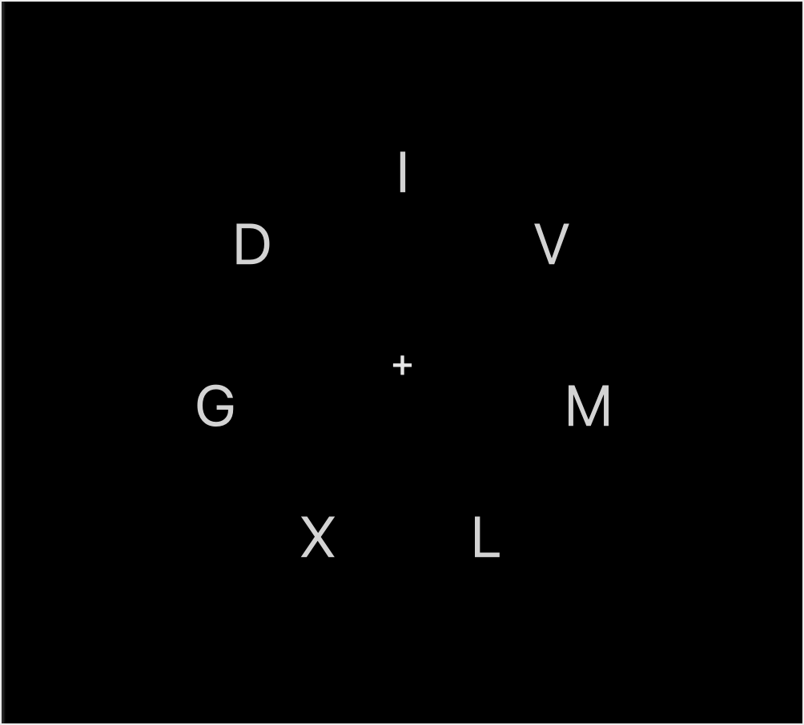

# PCBS_Project: The Attentional Blink in Visual Perception

# Background 
The role of attention and how it acts as a filter for visual perception has long been a topic of interest in psychology. Previous experiments showed effects such as inattentional blindness, whereby a stimulus or a change in the stimulus are not perceived in moments of inattention, suggest attention is necessary for perception. Subsequent experiments investigating how attention modulates perception reported periods of inattention in Rapid Serial Visual Presentation (RSVP), as detection of a second target was poor if it is presented within a certain time interval following the first target, a phenomenon which the research group coined “attentional blink” (Raymond, Shapiro & Arnell, 1992). This suggests the presence of a refractory period after presentation of a target, during which we are blind to any new targets presented. This experiment is adapted from a paper by Kristjansson and Nakayama, where they design a paradigm to investigate the attentional blink (Kristjánsson & Nakayama, 2002). They made an experiment to look at time and also spatial relationships between the targets. The space variable in perception is interesting as visual attention is often referred to as “spotlight-like”, meaning a gaussian curve applies to focus and resolution, which is maximal at the centre and falls in the edges of visual attention. 

# Aim 
Understanding the relationship between attention and perception, specifically the temporal and spatial properties of the attentional blink (AB) in visual perception.

# Procedure Outline
(This section refers to default setting values, but these can easily be modified in the code.)
The paradigm used is an RSVP task. Each frame presents seven streams of upper-case letters (distractors) equally spaced in a circle around a central fixation cross, on a black square background. 

These distractors are randomly selected from the alphabet and change every 140ms but the positions of the streams of letters remained the same within the same trial. For each trial, 30 frames are presented, within which two integers (targets), T1 and T2, are randomly chosen from 2-9 and their position is arbitrarily determined every time. (1 is omitted due to its resemblance to the letter I). The targets appear between frames 10 and 25 (so that they are flanked by frames showing distractors only). The time gap between T1 one T2 varies from 1 to 6 frames (149-840ms), and their relative positions change every trial, to measure the effect of temporal and spatial properties on the attentional blink effect.

In each trial, the participant is shown 30 frames, and once the sequence presentation is over, the computer asks them to type in the two digits that appeared in the previous trial, giving them feedback after both answers have been inputted, by coloring the answer red if incorrect and green if correct. They were prompted to guess when unsure but press “0” if they did not want to guess.

# User’s Guide to the Code
This code requires the PyQt library to run. Instructions on how to install PyQt can be found in this link: [link to PyQt!](https://doc.bccnsoft.com/docs/PyQt5/installation.html).
The folder PCBS_Project contains all the necessary elements to run the experiment. “FunModule.py” contains all the functions, and the code the experimenter needs to run is called “LastFebAssignment.py”. All experimental settings can be found at the beginning of this file and can be modified to the experimenter’s preferences, without needing any changes in the rest of the code. The raw data is stored in a file named “data.csv”, located in the same folder as the programme. The format is one line per trial, and the conditions, difference in time (milliseconds) and position of the targets (in terms of number of polygon sides between the targets and absolute distance in Qt Designer units), which were randomly selected by the computer, will be specified, along with the accuracy of the participant’s answers (0 for incorrect and 1 for correct).

# Program Highlights
The advantage of the programme is it allows for different numbers of streams to appear on screen. The createPoly function uses methods from the math module to automatically create coordinates for the vertices for a polygon along a circle of custom radius, and allowing for random degree of rotation at each trial (so that the vertices can be randomly placed along the circle and there is not always a label the Y axis, for example. This adds a lot of flexibility to the experiment, as the experimenter might be interested in the effect of changing visual load on the attentional blink. By changing one variable, ui.streams (the number of streams hence the number of sides to the polygon), the code adapts by creating that exact number of labels to then hold the distractors and targets. A set of variables initialised at the beginning of the program, to allow for flexible modifications such as the speed of the frames, the number of frames per trial, and the number of trials. There is also the option to add any number of practice trials. The stimuli (currently capital letters from the whole alphabet and numbers 2-9) can also be changed by creating new lists.
There is no need to press buttons once the experiment has started, automatic page chances following timers and keypresses. 

Randomisation occurs on 3 levels: the rotation of the polygon on the circle, the conditions of time delay and distance between the two targets. The conditions are sampled evenly (so all conditions occur if number of trials = number of conditions) so even if the number of trials isn’t an exact multiple of the number of conditions, the same condition isn’t repeated until all conditions have been tested.

# References
Kristjánsson, Á. and Nakayama, K., 2002. The attentional blink in space and time. Vision research, 42(17), pp.2039-2050.
Raymond, J.E., Shapiro, K.L. and Arnell, K.M., 1992. Temporary suppression of visual processing in an RSVP task: An attentional blink?. Journal of experimental psychology: Human perception and performance, 18(3), p.849.
